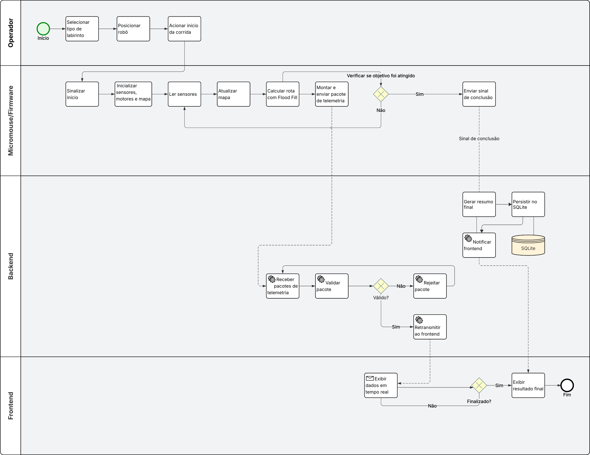

# Diagrama BPMN

O diagrama BPMN representa o fluxo principal de uma corrida do Micromouse, desde o acionamento do robô pelo operador até o monitoramento em tempo real e a consulta ao histórico de corridas.

O nível adotado é descritivo, com foco nas responsabilidades dos participantes, nas mensagens trocadas entre eles e nas principais decisões do processo.

<!-- TODO: inserir o diagrama quando disponível -->
<!--  -->

---

## Participantes do processo

| Participante | Responsabilidade |
|---|---|
| **Operador** | Prepara o robô, inicia a corrida, acompanha a telemetria e consulta o histórico |
| **Micromouse / Firmware** | Executa a navegação autônoma, lê sensores, controla motores, atualiza o mapa e envia telemetria |
| **Sistema Web** | Recebe, valida, exibe e armazena os dados da corrida |

O Sistema Web é dividido em duas partes:

| Área | Responsabilidade |
|---|---|
| **Backend FastAPI** | Recebe os dados do robô, valida os pacotes, retransmite ao frontend e registra o resultado no banco |
| **Frontend HTML/CSS/JS** | Exibe o painel de monitoramento, atualiza o mapa em tempo real e apresenta o histórico |

---

## Dados utilizados no processo

| Dado | Origem | Uso |
|---|---|---|
| Pacote de telemetria | Firmware | Enviado ao backend para atualização do dashboard |
| Sinal de conclusão | Firmware | Indica o encerramento da corrida |
| Dados em tempo real | Backend | Enviados ao frontend para exibição |
| Resumo final da corrida | Backend | Exibido no frontend e salvo no banco |
| Histórico de corridas | SQLite | Consultado pelo backend e exibido no frontend |
| Mapa do labirinto | Firmware | Usado internamente para navegação |
| Leituras dos sensores | Sensores físicos | Usadas pelo firmware para detectar paredes |

O SQLite não é representado como participante do processo, pois não executa ações próprias. Ele funciona como armazenamento persistente acessado pelo backend.

---

## Fluxo principal da corrida

O processo inicia quando o operador seleciona o tipo de labirinto, posiciona o robô na célula de partida e aciona o início da corrida.

Após receber o sinal de início, o firmware inicializa os sensores, os motores e a estrutura interna do mapa. A partir desse ponto, o robô passa a operar de forma autônoma, sem intervenção externa.

Durante a corrida, o firmware executa dois fluxos em paralelo:

```text
1. Navegação:
   leitura dos sensores → atualização do mapa → cálculo da rota → controle dos motores

2. Telemetria:
   montagem dos pacotes → envio dos dados ao backend → repetição contínua durante a corrida
````

Na fase de exploração, o robô percorre o labirinto célula por célula, identifica paredes e atualiza o mapa interno. Com base nessas informações, utiliza o algoritmo Flood Fill para escolher o próximo movimento em direção ao objetivo.

Após encontrar o caminho, o robô realiza a corrida utilizando o mapa construído, buscando alcançar a sala central de forma mais eficiente. Ao concluir a corrida, o firmware envia um sinal de conclusão ao backend.

---

## Processamento no Sistema Web

O backend recebe os pacotes de telemetria enviados pelo firmware por WebSocket. Cada pacote é validado antes de ser processado.

Se o pacote for válido, os dados são retransmitidos ao frontend para atualização do painel em tempo real. Se o pacote for inválido, ele é rejeitado sem interromper o funcionamento do servidor.

Quando o backend recebe o sinal de conclusão, compila o resumo final da corrida, envia o resultado consolidado ao frontend e registra os dados no SQLite.

O frontend mantém a conexão com o backend, atualiza o mapa e exibe os principais dados da corrida:

* tipo do labirinto;
* trajeto percorrido;
* bateria;
* velocidade média;
* tempo;
* status do desafio.

Ao detectar a conclusão da corrida, o frontend exibe a tela com o resultado final. Opcionalmente, o operador pode consultar o histórico de corridas filtrando por tipo de labirinto ou visualizando todos os registros.

---

## Fluxo resumido

```text
Operador
  → seleciona labirinto
  → posiciona o robô
  → aciona início

Firmware
  → inicializa sensores e motores
  → lê sensores
  → atualiza mapa
  → calcula rota com Flood Fill
  → controla motores
  → envia telemetria
  → detecta conclusão
  → envia sinal final

Backend
  → recebe telemetria
  → valida pacotes
  → retransmite ao frontend
  → recebe sinal de conclusão
  → gera resumo final
  → salva no SQLite

Frontend
  → exibe dados em tempo real
  → atualiza o mapa
  → mostra resultado final
  → permite consulta ao histórico
```

---

## Eventos principais

| Evento                    | Participante | Descrição                                |
| ------------------------- | ------------ | ---------------------------------------- |
| Início da corrida         | Operador     | O operador aciona o início do desafio    |
| Recebimento do início     | Firmware     | O robô inicia sua execução autônoma      |
| Envio de telemetria       | Firmware     | O robô envia dados periódicos ao backend |
| Recebimento de telemetria | Backend      | O servidor recebe e valida os dados      |
| Atualização do painel     | Frontend     | A interface exibe os dados recebidos     |
| Conclusão da corrida      | Firmware     | O robô detecta o fim do percurso         |
| Persistência dos dados    | Backend      | O resultado final é salvo no SQLite      |
| Consulta de histórico     | Operador     | O operador visualiza corridas anteriores |

---

## Gateways do processo

| Gateway                      | Tipo      | Função                                                                 |
| ---------------------------- | --------- | ---------------------------------------------------------------------- |
| Navegação e telemetria       | Paralelo  | Permite que o robô navegue e envie dados simultaneamente               |
| Objetivo atingido?           | Exclusivo | Decide se o robô continua navegando ou encerra a fase                  |
| Pacote válido?               | Exclusivo | Decide se o backend processa ou rejeita os dados recebidos             |
| Sinal de conclusão presente? | Exclusivo | Decide se a corrida será consolidada e salva                           |
| Corrida finalizada?          | Exclusivo | Decide se o frontend mantém o monitoramento ou exibe o resultado final |

---

## Objetos de conexão

| Objeto             | Uso                                                             |
| ------------------ | --------------------------------------------------------------- |
| Fluxo de sequência | Liga atividades dentro do mesmo participante                    |
| Fluxo de mensagem  | Representa a comunicação entre operador, firmware e sistema web |
| Associação         | Relaciona atividades aos dados produzidos ou consumidos         |

As principais mensagens trocadas no processo são:

```text
Operador → Firmware: sinal de início
Firmware → Backend: pacotes de telemetria
Firmware → Backend: sinal de conclusão
Backend → Frontend: dados processados em tempo real
Backend → Frontend: resumo final da corrida
```

---
## Diagrama BPMN



--- 

## Histórico de versões

| Versão | Data | Descrição | Autor(es) | Revisor(es) | Descrição da Revisão |
|:---:|:---:|:---:|:---:|:---:|:---:|
| `1.0` | 27/04/2026 | Criação do documento de descrição textual do Diagrama BPMN | [Arthur Moreira](https://github.com/arthurrochamoreira) | [Eduardo Ferreira](https://github.com/eduardoferre) | |
| `1.1` | 29/04/2026 | Melhoria da estrutura do documento | [Arthur Moreira](https://github.com/arthurrochamoreira) | [Eduardo Ferreira](https://github.com/eduardoferre) | |
| `1.2` | 29/04/2026 | Reorganização da descrição textual do BPMN | [Arthur Moreira](https://github.com/arthurrochamoreira) | [Eduardo Ferreira](https://github.com/eduardoferre) | |
| `1.3` | 07/05/2026 | Elaboração e Adição do Diagrama BPMN| [Eduardo Ferreira](https://github.com/eduardoferre) | Pendente | |
