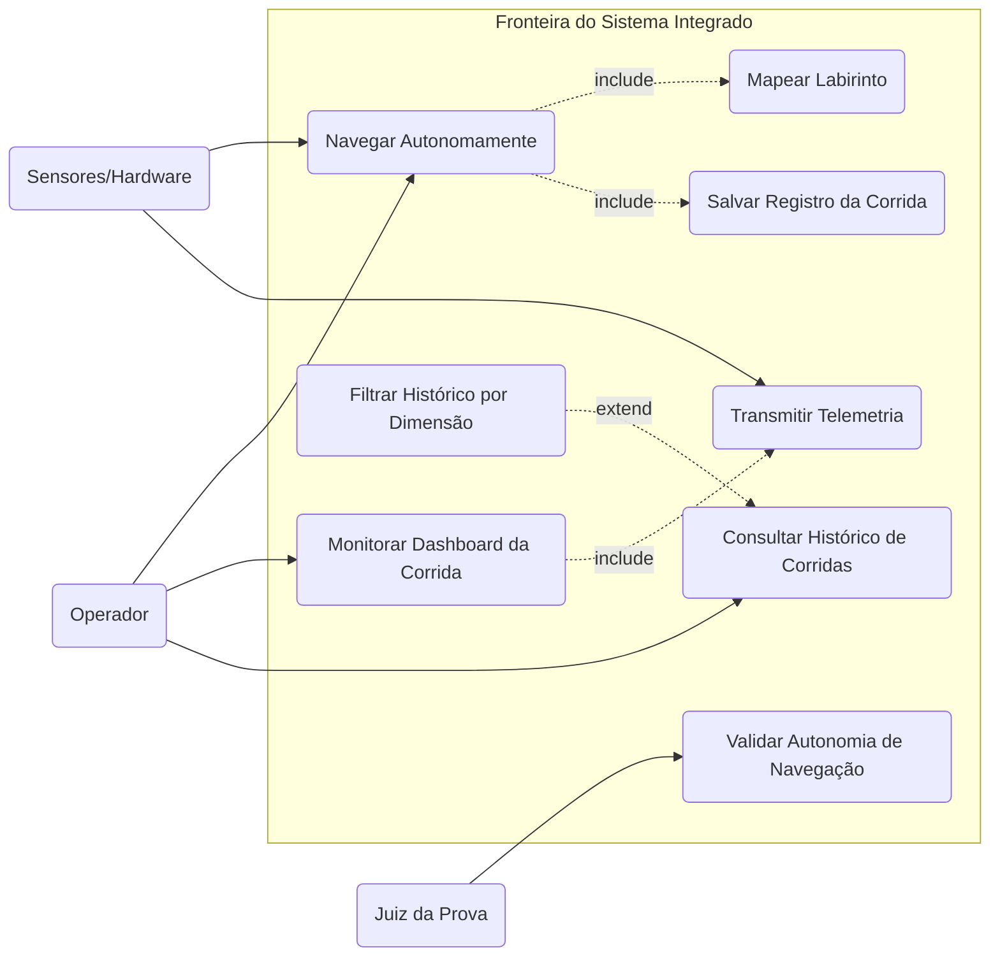

# Diagrama de Casos de Uso (UML)

Este documento mapeia os requisitos funcionais do projeto Micromouse através da perspectiva de Casos de Uso, definindo as fronteiras do sistema, os atores envolvidos e as interações primárias.

## 1. Fronteiras do Sistema

O sistema integrado é composto por duas camadas lógicas principais que operam em conjunto:
- **Firmware (Micromouse):** Responsável pela navegação, detecção física e transmissão de dados brutos via rede local (UDP/WebSocket).
- **Sistema Web (Backend/Frontend):** Responsável por receber, processar, exibir em tempo real e persistir os dados da telemetria (FastAPI + SQLite).

## 2. Atores do Sistema

Os atores representam entidades externas (humanas ou de hardware) que interagem com o sistema para enviar informações ou extrair valor.

| Ator | Tipo | Descrição |
|---|---|---|
| **Operador** | Humano (Primário) | Responsável por inicializar o robô no labirinto, monitorar o dashboard web em tempo real e consultar históricos de desempenho. |
| **Juiz da Prova** | Humano (Primário) | Responsável por validar os critérios da competição, assegurando que o robô cumpre o percurso sem intervenção de controle externo. |
| **Sensores e Hardware** | Sistema Externo (Secundário) | Módulos físicos (sensores infravermelhos/ultrassônicos, encoders, bateria) que fornecem os dados do mundo real para o Firmware. |

## 3. Casos de Uso Mapeados

A nomenclatura dos casos de uso adota verbos no infinitivo, refletindo as ações diretas mapeadas a partir do Backlog Funcional (MoSCoW).

### 3.1. Módulo de Navegação e Telemetria (Firmware)
- **UC01: Navegar Autonomamente:** O sistema controla os motores e corrige a trajetória via PID para evitar colisões (Cobre US01, US02, US05, US07).
- **UC02: Mapear Labirinto:** O sistema registra na memória as coordenadas, paredes detectadas e identifica a sala central (Cobre US03, US04).
- **UC03: Transmitir Telemetria:** O sistema realiza o envio contínuo de dados de trajeto, bateria, velocidade e status (Cobre US08, US09).

### 3.2. Módulo de Monitoramento e Persistência (Sistema Web)
- **UC04: Monitorar Dashboard da Corrida:** O Operador visualiza a renderização do mapa, cronômetro, velocidade média e nível de bateria em tempo real (Cobre US10, US11, US12).
- **UC05: Salvar Registro da Corrida:** O sistema grava os dados consolidados no banco de dados SQLite ao término do percurso (Cobre US13).
- **UC06: Consultar Histórico de Corridas:** O Operador visualiza os logs de corridas passadas armazenadas no banco de dados (Cobre US14).
- **UC07: Filtrar Histórico por Dimensão:** O Operador refina a busca no banco de dados especificando o tamanho do labirinto (4x4, 8x8 ou 16x16) (Cobre US14).
- **UC08: Validar Autonomia de Navegação:** O Juiz da Prova atesta visualmente e logicamente que o sistema ignorou comandos de direção externos (Cobre US06).

## 4. Relacionamentos Estruturais

Para estruturação nas ferramentas de modelagem (Draw.io, Lucidchart, Astah), os seguintes relacionamentos devem ser aplicados na ligação entre os Casos de Uso:

- **UC01 (Navegar Autonomamente)** `<<include>>` **UC02 (Mapear Labirinto):** A navegação funcional no contexto deste projeto exige o mapeamento simultâneo do espaço espacial.
- **UC04 (Monitorar Dashboard da Corrida)** `<<include>>` **UC03 (Transmitir Telemetria):** O dashboard web não pode operar ou exibir dados sem a recepção ativa da transmissão gerada pelo firmware.
- **UC01 (Navegar Autonomamente)** `<<include>>` **UC05 (Salvar Registro da Corrida):** A conclusão do percurso aciona obrigatoriamente a persistência dos dados de desempenho no backend.
- **UC07 (Filtrar Histórico por Dimensão)** `<<extend>>` **UC06 (Consultar Histórico de Corridas):** A aplicação do filtro é uma ação opcional executada a critério do operador durante a visualização do histórico.

## 5. Representação Textual do Diagrama 

