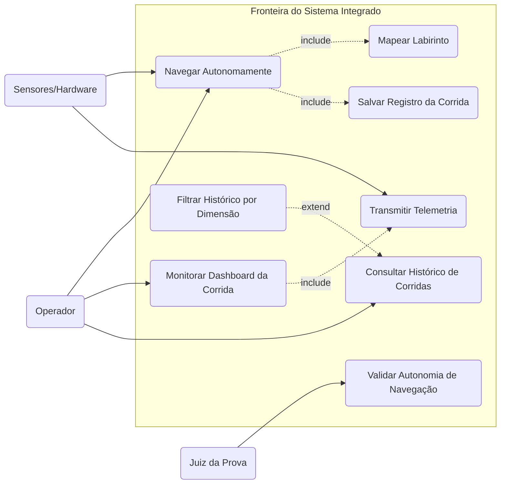
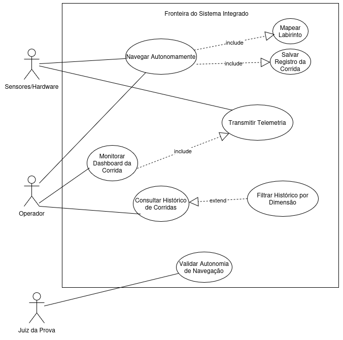

# Diagrama de Casos de Uso (UML)

Este documento mapeia os requisitos funcionais do projeto Micromouse sob a perspectiva de Casos de Uso, delimitando as fronteiras do sistema, identificando os atores envolvidos e explicitando as interações primárias. A finalidade do artefato é viabilizar a rastreabilidade entre as histórias de usuário e as funcionalidades do sistema, servindo de referência para o desenvolvimento e para a validação por meio dos casos de teste.

## Fronteiras do Sistema

O sistema integrado estrutura-se em duas camadas lógicas que operam de modo articulado. O firmware embarcado no Micromouse responde pela navegação, pela detecção física do ambiente e pela transmissão dos dados brutos por meio de rede local com protocolo WebSocket. O sistema web (composto por backend FastAPI e frontend) recebe, processa, exibe em tempo real e persiste os dados de telemetria no SQLite.

## Atores do Sistema

Os atores representam entidades externas (humanas ou de hardware) que interagem com o sistema, seja fornecendo informações, seja consumindo seus resultados.

| Ator | Tipo | Descrição |
|---|---|---|
| **Operador** | Humano (primário) | Inicializa o robô no labirinto, monitora o dashboard web em tempo real e consulta o histórico de desempenho |
| **Juiz da Prova** | Humano (primário) | Valida os critérios da competição, assegurando que o robô conclui o percurso sem intervenção de controle externo |
| **Sensores e Hardware** | Sistema externo (secundário) | Módulos físicos (sensores infravermelhos/ultrassônicos, encoders, bateria) que fornecem os dados do mundo real ao firmware |

## Casos de Uso Mapeados

A nomenclatura dos casos de uso adota verbos no infinitivo, refletindo as ações diretas mapeadas a partir do backlog funcional priorizado pelo método MoSCoW. Os casos foram agrupados em dois módulos, conforme a natureza das funcionalidades.

### Módulo de Navegação e Telemetria (Firmware)

O **UC01: Navegar Autonomamente** representa o controle dos motores e a correção da trajetória via PID para evitar colisões, cobrindo US01, US02, US05 e US07. O **UC02: Mapear Labirinto** consolida o registro das coordenadas e das paredes detectadas, bem como a identificação da sala central (US03 e US04). O **UC03: Transmitir Telemetria** explicita o envio contínuo dos dados de trajeto, bateria, velocidade e status (US08 e US09).

### Módulo de Monitoramento e Persistência (Sistema Web)

O **UC04: Monitorar Dashboard da Corrida** permite ao operador visualizar a renderização do mapa, o cronômetro, a velocidade média e o nível de bateria em tempo real, abrangendo US10, US11 e US12. O **UC05: Salvar Registro da Corrida** consolida a gravação dos dados no banco SQLite ao término do percurso (US13). O **UC06: Consultar Histórico de Corridas** viabiliza a visualização dos logs armazenados (US14), enquanto o **UC07: Filtrar Histórico por Dimensão** refina a consulta por tamanho de labirinto (4x4, 8x8 ou 16x16), também relacionado a US14. Por fim, o **UC08: Validar Autonomia de Navegação** representa a verificação, pelo juiz da prova, de que o sistema ignorou comandos externos de direção (US06).

## Relacionamentos Estruturais

A estruturação do diagrama nas ferramentas de modelagem (Draw.io, Lucidchart ou Astah) requer a aplicação de relacionamentos `<<include>>` e `<<extend>>` entre os casos de uso. A navegação autônoma (UC01) inclui obrigatoriamente o mapeamento do labirinto (UC02), uma vez que a navegação eficaz neste projeto depende do mapeamento simultâneo do espaço. O monitoramento do dashboard (UC04) inclui a transmissão de telemetria (UC03), pois o painel web depende da recepção ativa dos dados produzidos pelo firmware. A conclusão do percurso pela navegação (UC01) inclui a persistência do registro da corrida (UC05), assegurando o armazenamento dos dados de desempenho. Por sua vez, o filtro por dimensão (UC07) estende a consulta ao histórico (UC06), por se tratar de ação opcional executada a critério do operador.

## Representação Textual do Diagrama

A representação textual a seguir consolida atores, casos de uso e relacionamentos em formato compatível com ferramentas de modelagem baseadas em código.

## Diagrama UML de Casos de Uso

## Histórico de versões

| Versão |    Data    |                          Descrição                         |                        Autor(es)                        | Revisor(es) | Descrição da Revisão |
| :----: | :--------: | :--------------------------------------------------------: | :-----------------------------------------------------: | :---------: | :------------------: |
|  `1.0` | 04/05/2026 | Criação do documento de descrição textual do Diagrama de Casos de Uso | [Paulo Vitor](https://github.com/gpaulovit) |   [Eduardo Ferreira](https://github.com/eduardoferre)  |                      |
|  `1.1` | 05/05/2026 |             Adição do Diagrama UML             | [Eduardo Ferreira](https://github.com/eduardoferre) |   Pendente  |                      |
